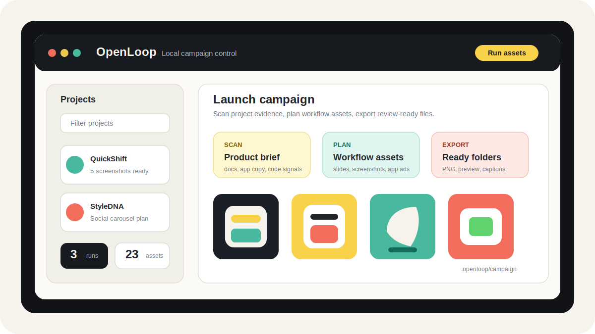

# OpenLoop

<p align="center">
  
</p>

[](https://github.com/oscarlehuu/openloop/actions/workflows/ci.yml)
[](LICENSE)

OpenLoop is a local-first CLI and dashboard for turning project context into marketing assets. It scans a local app or product repo, builds a compact campaign brief, plans workflow-specific assets, generates images, renders local copy overlays, and exports upload-ready files.

The repo is early. Expect rough edges, but the public surface is intentionally small: source, tests, docs, CI, and safe default config only.

## What It Builds

- Social slide carousels with six 9:16 image assets and a caption.
- App Store screenshot sets from real app screenshots, not invented UI.
- Mobile app ad storyboard references with clean green-screen phone plates for later compositing.
- A local dashboard for browsing tracked projects, campaign runs, previews, captions, and exports.

## Local-First Model

OpenLoop writes campaign output to `.openloop/campaign/`, which is ignored by git. Project registry state is local too and should stay out of public commits.

Codex OAuth credentials, if used, are stored in `~/.openloop/auth.json`. OpenLoop never needs credentials committed to this repo.

## Quick Start

```sh
npm install
npm run typecheck
npm test
npm run build
```

Create config:

```sh
npm run openloop -- init
```

Start the local dashboard:

```sh
npm run dev
```

Run the CLI during development:

```sh
npm run openloop -- --help
npm run openloop -- slides --project /path/to/project --name launch
```

## Core Workflows

```sh
npm run openloop -- slides --project /path/to/project --name launch
npm run openloop -- app-store --project /path/to/app --name screenshots --screenshots /path/to/real-screenshots
npm run openloop -- app-ads --project /path/to/app --name launch-ad --screenshots /path/to/real-screenshots
```

App Store and app ad workflows should start from real target-app screenshots. The image model can frame and polish around the screenshots, but it should not invent app UI, accounts, product states, labels, or feature results.

## Repository Structure

```text
src/
  campaign/       campaign planning and slide schema
  cli/            command handlers and pipeline runner
  config/         default config and output presets
  dashboard/      local read-only dashboard
  inspiration/    style-reference helpers
  projects/       local project registry
  providers/      image provider integrations
  rendering/      final asset rendering and exports
  runs/           campaign run storage layout
  scanner/        project evidence scanner
  validation/     run validation
  workflows/      workflow definitions and image strategies
tests/            node/vitest coverage
docs/             architecture, usage, and code standards
assets/images/    public README/demo assets
```

## Documentation

- [Local usage guide](docs/local-usage-guide.md)
- [Project overview](docs/project-overview-pdr.md)
- [System architecture](docs/system-architecture.md)
- [Code standards](docs/code-standards.md)

## Contributing

OpenLoop is public source, but still early. Keep changes local-first, avoid SaaS assumptions, and never commit generated campaign assets, registry files, auth files, screenshots containing private data, or credentials.

See [CONTRIBUTING.md](CONTRIBUTING.md) for the current contribution rules.
See [CODE_OF_CONDUCT.md](CODE_OF_CONDUCT.md), [SUPPORT.md](SUPPORT.md), and [SECURITY.md](SECURITY.md) for community and reporting expectations.

## License

MIT. See [LICENSE](LICENSE).
